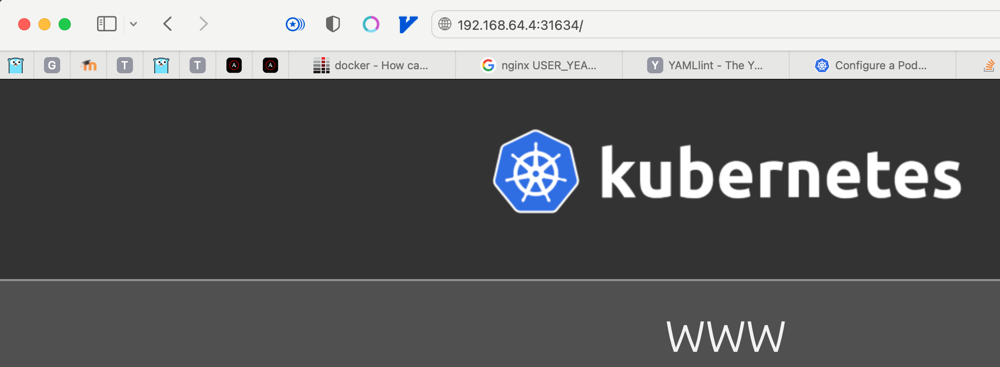
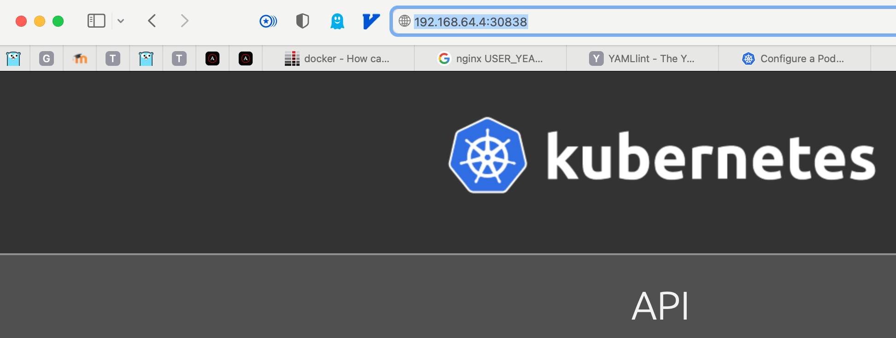
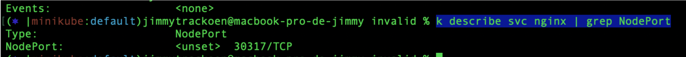
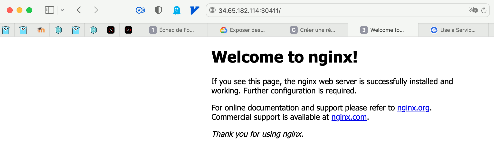

# IMT Nord Europe, TD 3 Kubernetes

**Clément Meiller - le 22 février 2022**

Système hôte utilisé pour la réalisation de ce TD :

```bash
$ system_profiler SPSoftwareDataType
Software:

    System Software Overview:

      System Version: macOS 12.1 (21C52)
      ...
```

## Exercice 1 - Installation

1. Installer la dernière version de Minikube
   
   ```bash
   $ brew upgrade kubectl
   ...
   $ kubectl version
   Client Version: version.Info{Major:"1", Minor:"22", GitVersion:"v1.22.5", GitCommit:"5c99e2ac2ff9a3c549d9ca665e7bc05a3e18f07e", GitTreeState:"clean", BuildDate:"2021-12-16T08:38:33Z", GoVersion:"go1.16.12", Compiler:"gc", Platform:"darwin/amd64"}
   $ minikube version                               
   minikube version: v1.17.0
   commit: 7e8b5a89575945ba8f8246bfe547178c1a995198
   $ brew upgrade minikube
   ...
   # Installation de l'autocomplétion pour Kubectl
   source <(kubectl completion zsh)  # active l'auto-complétion pour zsh dans le shell courant
   echo "[[ $commands[kubectl] ]] && source <(kubectl completion zsh)" >> ~/.zshrc # ajoute l'auto-complétion de manière permanente à votre shell zsh
   ```

2. Vérifier que minikube est bien installée ( minikube version )
   
   ```bash
   $ kubectl version
   Client Version: version.Info{Major:"1", Minor:"23", GitVersion:"v1.23.4", GitCommit:"e6c093d87ea4cbb530a7b2ae91e54c0842d8308a", GitTreeState:"clean", BuildDate:"2022-02-16T12:30:48Z", GoVersion:"go1.17.6", Compiler:"gc", Platform:"darwin/amd64"}
   $ minikube version
   minikube version: v1.25.1
   commit: 3e64b11ed75e56e4898ea85f96b2e4af0301f43d
   ```

<div style="page-break-after: always;"></div>

## Exercice 2 - Manipulation basique de pods

Le but de cet exercice est de comprendre comment fonctionne la création, la suppression et la modification de pods.

1. Avec la méthode impérative, créer un pod nginx avec pour nom nginx-pod-imperatif.
   
   ```bash
   $ minikube start # Démarrage de minikube
   ...
   🏄  Terminé ! kubectl est maintenant configuré pour utiliser "minikube" cluster et espace de noms "default" par défaut.
   $ kubectl get nodes 
   NAME       STATUS   ROLES                  AGE   VERSION
   minikube   Ready    control-plane,master   54s   v1.23.1
   $ kubectl run nginx-pod-imperatif --image nginx:latest
   pod/nginx-pod-imperatif created
   $ kubectl get pods
   NAME                   READY   STATUS    RESTARTS   AGE
   nginx-pod-imperatif    1/1     Running   0          12s
   ```

2. Avec la méthode déclarative, créer un pod nginx avec pour nom nginx-pod-declaratif.

3. ```bash
   $ kubectl run nginx-pod-declaratif --image nginx:latest --dry-run=client -o yaml > nginx-pod-declaratif.yml
   $ cat nginx-pod-declaratif.yml
   apiVersion: v1
   kind: Pod
   metadata:
     creationTimestamp: null
     labels:
       run: nginx-pod-declaratif
     name: nginx-pod-declaratif
   spec:
     containers:
     - image: nginx:latest
       name: nginx-pod-declaratif
       resources: {}
     dnsPolicy: ClusterFirst
     restartPolicy: Always
   status: {}
   $ kubectl apply -f nginx-pod-declaratif.yml 
   pod/nginx-pod-declaratif created
   $ kubectl get pods
   NAME                   READY   STATUS    RESTARTS   AGE
   nginx-pod-imperatif    1/1     Running   0          3m2s
   nginx-pod-declaratif   1/1     Running   0          29s
   ```

4. Avec la méthode impérative, créer un script shell permettant la création de 10 pods nginx nommé de nginx-1 à nginx-10
   
   ```bash
   $ for i in {1..10}; do ; kubectl run nginx-pod-imperatif-$i --image nginx:latest ; done
   
   pod/nginx-pod-imperatif-1 created
   pod/nginx-pod-imperatif-2 created
   pod/nginx-pod-imperatif-3 created
   pod/nginx-pod-imperatif-4 created
   pod/nginx-pod-imperatif-5 created
   pod/nginx-pod-imperatif-6 created
   pod/nginx-pod-imperatif-7 created
   pod/nginx-pod-imperatif-8 created
   pod/nginx-pod-imperatif-9 created
   pod/nginx-pod-imperatif-10 created
   ```

5. Stocker le nom et l’adresse IP de tous les pods dans un fichier nommé all-pods.txt
   
   ```bash
   $ kubectl get pods -o custom-columns=NAME:.metadata.name,IP:.status.podIP > all-pods.txt
   $ cat all-pods.txt
   NAME                     IP
   nginx-pod-declaratif     172.17.0.3
   nginx-pod-imperatif      172.17.0.4
   nginx-pod-imperatif-1    172.17.0.5
   nginx-pod-imperatif-10   172.17.0.14
   nginx-pod-imperatif-2    172.17.0.6
   nginx-pod-imperatif-3    172.17.0.8
   nginx-pod-imperatif-4    172.17.0.7
   nginx-pod-imperatif-5    172.17.0.10
   nginx-pod-imperatif-6    172.17.0.9
   nginx-pod-imperatif-7    172.17.0.12
   nginx-pod-imperatif-8    172.17.0.11
   nginx-pod-imperatif-9    172.17.0.13
   ```

6. Supprimer l’ensemble des pods créés pour cet exercice.
   
   ```bash
   $ kubectl delete pods --all
   pod "nginx-pod-declaratif" deleted
   pod "nginx-pod-imperatif" deleted
   pod "nginx-pod-imperatif-1" deleted
   pod "nginx-pod-imperatif-10" deleted
   pod "nginx-pod-imperatif-2" deleted
   pod "nginx-pod-imperatif-3" deleted
   pod "nginx-pod-imperatif-4" deleted
   pod "nginx-pod-imperatif-5" deleted
   pod "nginx-pod-imperatif-6" deleted
   pod "nginx-pod-imperatif-7" deleted
   pod "nginx-pod-imperatif-8" deleted
   pod "nginx-pod-imperatif-9" deleted
   $ kubectl get pods 
   No resources found in default namespace.
   ```

<div style="page-break-after: always;"></div>

## Exercice 3 - Manipulation de replicasets

Le but de cet exercice est de comprendre comment fonctionne la création, la suppression et la modification d’un replicaset.

1. Créer un réplicaset nommé webapp-replicaset-imperatif créer à partir de l’image que vous avez poussé sur votre repository lors du précédent TP ( si vous n’avez pas fait l’exercice partir d’une image nginx ) de manière impérative.
   
   ```bash
   $ vim webapp-replicaset-imperatif.yml
   ```
   
   ```yaml
   apiVersion: apps/v1
   kind: ReplicaSet
   metadata:
     name: webapp-replicaset-imperatif
     labels:
       app: docker-db-connection
       tier: frontend
   spec:
     replicas: 3
     selector:
       matchLabels:
         tier: frontend
     template:
       metadata:
         labels:
           tier: frontend
       spec:
         containers:
         - name: docker-db-connection
           image: clemmei/docker-db-connection:1.0.0
   ```
   
   ```bash
   #On utilise la commande create pour la méthode impérative
   $ kubectl create -f webapp-replicaset-imperatif.yml
   replicaset.apps/webapp-replicaset-imperatif created
   $ kubectl get rs 
   NAME                          DESIRED   CURRENT   READY   AGE
   webapp-replicaset-imperatif   3         3         0       4m17s
   $ kubectl get pods
   NAME                                READY   STATUS    RESTARTS   AGE
   webapp-replicaset-imperatif-6j2cc   1/1     Running   0          25s
   webapp-replicaset-imperatif-b4bwf   1/1     Running   0          25s
   webapp-replicaset-imperatif-s9pmn   1/1     Running   0          25s
   ```

2. Créer un réplicaset nommé webapp-replicaset-declaratif créé à partir de l’image que vous avez poussé sur votre repository lors du précédent TP ( si vous n’avez pas fait l’exercice partir d’une image nginx ) de manière déclarative.
   
   ```bash
   $ cp webapp-replicaset-imperatif.yml webapp-replicaset-declaratif.yml 
   $ vim webapp-replicaset-declaratif.yml
   ```
   
   ```yaml
   apiVersion: apps/v1
   kind: ReplicaSet
   metadata:
     name: webapp-replicaset-declaratif
     labels:
       app: docker-db-connection
       tier: frontend
   spec:
     # modify replicas according to your case
     replicas: 3
     selector:
       matchLabels:
         tier: frontend
     template:
       metadata:
         labels:
           tier: frontend
       spec:
         containers:
         - name: docker-db-connection
           image: clemmei/docker-db-connection:1.0.0
   ```
   
   ```bash
   $ kubectl apply -f webapp-replicaset-declaratif.yml
   replicaset.apps/webapp-replicaset-declaratif created
   $ kubectl get rs
   NAME                           DESIRED   CURRENT   READY   AGE
   webapp-replicaset-declaratif   3         3         0       41s
   webapp-replicaset-imperatif    3         3         0       11m
   $ kubectl get pods
   NAME                                 READY   STATUS    RESTARTS   AGE
   webapp-replicaset-declaratif-f5m4h   1/1     Running   0          42s
   webapp-replicaset-declaratif-qhfmh   1/1     Running   0          42s
   webapp-replicaset-declaratif-rqdkw   1/1     Running   0          42s
   webapp-replicaset-imperatif-6j2cc    1/1     Running   0          3m40s
   webapp-replicaset-imperatif-b4bwf    1/1     Running   0          3m40s
   webapp-replicaset-imperatif-s9pmn    1/1     Running   0          3m40s
   ```

3. Scaler le premier replicas à 5 instances de manière impérative.
   
   ```bash
   $ kubectl scale replicaset webapp-replicaset-imperatif --replicas 5
   replicaset.apps/webapp-replicaset-imperatif scaled
   $ kubectl get rs
   NAME                           DESIRED   CURRENT   READY   AGE
   webapp-replicaset-declaratif   3         3         0       3m15s
   webapp-replicaset-imperatif    5         5         0       13m
   $ kubectl get pods
   NAME                                 READY   STATUS    RESTARTS   AGE
   webapp-replicaset-declaratif-f5m4h   1/1     Running   0          79s
   webapp-replicaset-declaratif-qhfmh   1/1     Running   0          79s
   webapp-replicaset-declaratif-rqdkw   1/1     Running   0          79s
   webapp-replicaset-imperatif-6j2cc    1/1     Running   0          4m17s
   webapp-replicaset-imperatif-b4bwf    1/1     Running   0          4m17s
   webapp-replicaset-imperatif-jv9tn    1/1     Running   0          4s
   webapp-replicaset-imperatif-s9pmn    1/1     Running   0          4m17s
   webapp-replicaset-imperatif-zwld2    1/1     Running   0          4s
   ```

4. Scaler le second replicas à 7 instances de manière déclarative.
   
   ```bash
   $ vim webapp-replicaset-declaratif.yml
   ```
   
   ```yaml
   apiVersion: apps/v1
   kind: ReplicaSet
   metadata:
     name: webapp-replicaset-declaratif
     labels:
       app: docker-db-connection
       tier: frontend
   spec:
     # modify replicas according to your case
     replicas: 7 #je scale en modifiant ce paramètre 
     selector:
       matchLabels:
         tier: frontend
     template:
       metadata:
         labels:
           tier: frontend
       spec:
         containers:
         - name: docker-db-connection
           image: clemmei/docker-db-connection:1.0.0
   ```
   
   ```bash
   $ kubectl apply -f webapp-replicaset-declaratif.yml
   replicaset.apps/webapp-replicaset-declaratif configured
   $ kubectl get rs 
   NAME                           DESIRED   CURRENT   READY   AGE
   webapp-replicaset-declaratif   7         7         0       11m
   webapp-replicaset-imperatif    5         5         0       22m
   $ kubectl get pods
   NAME                                 READY   STATUS    RESTARTS   AGE
   webapp-replicaset-declaratif-5ffvp   1/1     Running   0          44s
   webapp-replicaset-declaratif-f5m4h   1/1     Running   0          2m57s
   webapp-replicaset-declaratif-g28zn   1/1     Running   0          44s
   webapp-replicaset-declaratif-mrcvh   1/1     Running   0          44s
   webapp-replicaset-declaratif-qhfmh   1/1     Running   0          2m57s
   webapp-replicaset-declaratif-rqdkw   1/1     Running   0          2m57s
   webapp-replicaset-declaratif-xrgjd   1/1     Running   0          44s
   webapp-replicaset-imperatif-6j2cc    1/1     Running   0          5m55s
   webapp-replicaset-imperatif-b4bwf    1/1     Running   0          5m55s
   webapp-replicaset-imperatif-jv9tn    1/1     Running   0          102s
   webapp-replicaset-imperatif-s9pmn    1/1     Running   0          5m55s
   webapp-replicaset-imperatif-zwld2    1/1     Running   0          102s
   ```

5. Quel mécanisme proposé par Kubernetes devrons-nous utiliser ici pour exposer nos applications sur le web ?
   
   * Il nous faudra utiliser un *service* de type *NodePort* dans le cas de l'utilisation avec minikube
     Pour une plateforme de production, sauf cas particulier, on privilégiera un service de type *LoadBalancer*.

6. Supprimer les 2 replicasets.
   
   ```bash
   $ kubectl delete rs webapp-replicaset-declaratif webapp-replicaset-imperatif 
   replicaset.apps "webapp-replicaset-declaratif" deleted
   replicaset.apps "webapp-replicaset-imperatif" deleted
   $ kubectl get rs
   No resources found in default namespace.
   $ kubectl get pods
   No resources found in default namespace.
   ```

<div style="page-break-after: always;"></div>

## Exercice 4 - Manipulation de déploiements.

Objectif: Le but de cet exercice est de comprendre comment fonctionne la création, la
suppression et la modification et la mise à jour d’un déploiement.

1. Créer un deployment nommé nginx-deployment-imperatif créer à partir de l’image
   nginx:1.15.0
   
   ```bash
   $ kubectl create deployment nginx-deployment-imperatif --image nginx:1.15.0       
   $ kubectl get deployments.apps 
   NAME                         READY   UP-TO-DATE   AVAILABLE   AGE
   nginx-deployment-imperatif   1/1     1            1           37s
   $ kubectl get pods
   NAME                                          READY   STATUS    RESTARTS   AGE
   nginx-deployment-imperatif-758b79f9b9-drkzr   1/1     Running   0          67s
   ```

2. Créer un deployment nommé webapp-deployment-declaratif créer à partir de l’image nginx:1.15.0
   
   ```bash
   $ kubectl create deployment nginx-deployment-declaratif --image nginx:1.15.0 --dry-run=client -o yaml > nginx-deployment-declaratif.yml
   $ cat nginx-deployment-declaratif.yml
   apiVersion: apps/v1
   kind: Deployment
   metadata:
     creationTimestamp: null
     labels:
       app: nginx-deployment-declaratif
     name: nginx-deployment-declaratif
   spec:
     replicas: 1
     selector:
       matchLabels:
         app: nginx-deployment-declaratif
     strategy: {}
     template:
       metadata:
         creationTimestamp: null
         labels:
           app: nginx-deployment-declaratif
       spec:
         containers:
         - image: nginx:1.15.0
           name: nginx
           resources: {}
   status: {}
   $ kubectl apply -f nginx-deployment-declaratif.yml
   deployment.apps/nginx-deployment-declaratif created
   $ kubectl get deployments.apps
   NAME                          READY   UP-TO-DATE   AVAILABLE   AGE
   nginx-deployment-declaratif   1/1     1            1           88s
   nginx-deployment-imperatif    1/1     1            1           7m38s
   $ kubectl get pods
   NAME                                           READY   STATUS    RESTARTS   AGE
   nginx-deployment-declaratif-5fd64d5f85-thc9l   1/1     Running   0          116s
   nginx-deployment-imperatif-758b79f9b9-drkzr    1/1     Running   0          8m6s
   ```

3. Lister les déploiements présents dans votre cluster.
   
   ```bash
   $ kubectl get deployments.apps
   NAME                          READY   UP-TO-DATE   AVAILABLE   AGE
   nginx-deployment-declaratif   1/1     1            1           88s
   nginx-deployment-imperatif    1/1     1            1           7m38s
   ```

4. Upgrader l’image du premier déploiement de manière impérative vers la dernière version de nginx.
   
   ```bash
   $ kubectl set image deployment nginx-deployment-imperatif nginx=nginx:latest
   $ kubectl get deployments.apps nginx-deployment-imperatif -o yaml | grep image:
         - image: nginx:latest
   ```

5. Upgrader l’image du dernier déploiement de manière déclarative vers la dernière version de nginx.
   
   ```bash
   $ vim nginx-deployment-declaratif.yml
   ```
   
   ```yaml
   apiVersion: apps/v1
   kind: Deployment
   metadata:
     creationTimestamp: null
     labels:
       app: nginx-deployment-declaratif
     name: nginx-deployment-declaratif
   spec:
     replicas: 1
     selector:
       matchLabels:
         app: nginx-deployment-declaratif
     strategy: {}
     template:
       metadata:
         creationTimestamp: null
         labels:
           app: nginx-deployment-declaratif
       spec:
         containers:
         - image: nginx:latest #je met à jour la version de l'image
           name: nginx
           resources: {}
   status: {}
   ```
   
   ```bash
   $ kubectl apply -f nginx-deployment-declaratif.yml
   deployment.apps/nginx-deployment-declaratif configured
   $ kubectl get deployments.apps nginx-deployment-declaratif -o yaml | grep image: 
         - image: nginx:latest
   ```

6. Lister les replica sets présent dans votre cluster.
   
   ```bash
   $ kubectl get rs
   NAME                                     DESIRED   CURRENT   READY   AGE
   nginx-deployment-declaratif-588684dfdf   1         1         1       3m44s
   nginx-deployment-declaratif-5fd64d5f85   0         0         0       49m
   nginx-deployment-imperatif-5cc94b75c7    1         1         1       11m
   nginx-deployment-imperatif-758b79f9b9    0         0         0       55m
   ```

7. Qu’en constatez-vous ?
   
   * Je constate que j'ai quatre Replicaset dont deux actif :
     
     - un *nginx-deployment-declaratif-588684dfdf* 
     
     - un *nginx-deployment-imperatif-5cc94b75c7*. 
     
     Situation normale, mes deux autres replicasets seront disponibles en cas de rollout.

8. Faire un rollback impératif à la version antérieure des deux déploiements.
   
   ```bash
   $ kubectl rollout undo deployment nginx-deployment-imperatif nginx-deployment-declaratif
   $ kubectl get rs 
   NAME                                     DESIRED   CURRENT   READY   AGE
   nginx-deployment-declaratif-588684dfdf   0         0         0       27m
   nginx-deployment-declaratif-5fd64d5f85   1         1         1       73m
   nginx-deployment-imperatif-5cc94b75c7    0         0         0       34m
   nginx-deployment-imperatif-758b79f9b9    1         1         1       79m
   ```

9. Supprimer les deux déploiements.
   
   ```bash
   $ kubectl delete deployments.apps nginx-deployment-declaratif nginx-deployment-imperatif
   deployment.apps "nginx-deployment-declaratif" deleted
   deployment.apps "nginx-deployment-imperatif" deleted
   $ kubectl get deployments.apps
   No resources found in default namespace.
   ```

<div style="page-break-after: always;"></div>

## Exercice 5 - Manipulation de Services

1. Créer un déploiement nginx-deploiement à partir d’une image nginx.
   
   ```bash
   $ kubectl create deployment nginx-deployment --image nginx:latest --dry-run=client -o yaml > nginx-deployment.yml
   $ kubectl apply -f nginx-deployment.yml
   deployment.apps/nginx-deployment created
   $ kubectl get deployments.apps
   NAME               READY   UP-TO-DATE   AVAILABLE   AGE
   nginx-deployment   1/1     1            1           11s
   ```

2. Lier les containers du déploiement nginx-deployment avec un nouveau service de type ClusterIp nommer nginx-svc-cluster-ip.
   
   ```bash
   $ kubectl expose deployment nginx-deployment --name nginx-svc-cluster-ip  --type ClusterIP --port 8080 --target-port 80 --output yaml --dry-run=client > nginx-svc-cluster-ip.yml
   $ kubectl apply -f nginx-svc-cluster-ip.yml
   service/nginx-svc-cluster-ip created
   ```

3. Récupérer l’adresse IP du service et le stocker dans un fichier nommer service-ip.txt
   
   ```bash
   $ kubectl get services nginx-svc-cluster-ip -o custom-columns=SERVICE-IP:.spec.clusterIP > service-ip.txt
   $ cat service-ip.txt
   SERVICE-IP
   10.105.9.154
   ```

4. Créer un pods nommé utils à partir d’une image nginx.
   
   ```bash
   $ kubectl run utils --image nginx:latest
   pod/utils created
   $ kubectl get pods
   NAME                                READY   STATUS    RESTARTS   AGE
   nginx-deployment-7fd6754bf7-mc64v   1/1     Running   0          19m
   utils                               1/1     Running   0          27s
   ```

5. Se connecter au pods utils ( kubectl exec -ti <nom-du-pod> – /bin/bash )
   
   ```bash
   $ kubectl exec -ti utils /bin/bash
   root@utils:/# 
   ```

6. Installer curl
   
   * Curl est déjà disponible sur le conteneur

7. Lancer un curl sur le service nginx-svc-cluster-ip.
   
   ```bash
   root@utils:/# curl 10.105.9.154:8080
   <!DOCTYPE html>
   <html>
   <head>
   <title>Welcome to nginx!</title>
   <style>
   html { color-scheme: light dark; }
   body { width: 35em; margin: 0 auto;
   font-family: Tahoma, Verdana, Arial, sans-serif; }
   </style>
   </head>
   <body>
   <h1>Welcome to nginx!</h1>
   <p>If you see this page, the nginx web server is successfully installed and
   working. Further configuration is required.</p>
   
   <p>For online documentation and support please refer to
   <a href="http://nginx.org/">nginx.org</a>.<br/>
   Commercial support is available at
   <a href="http://nginx.com/">nginx.com</a>.</p>
   
   <p><em>Thank you for using nginx.</em></p>
   </body>
   </html>
   ```

8. Avec vos mots, expliquez le concept de service dans kubernetes.
   
   * Un service permet d'ouvrir des accès à une application. 
     On peut imaginer par exemple donner l'accès 
     
     - **aux utilisateurs** par le biais d'un service de type *LoadBalancer* qui permettra l'accès externe (dans le cas ou nous utilisons le service managé d'un cloud provider)
     
     - **pour des besoins de communications entre replica sets**, par exemple entre un front-end et un back-end par le biais d'un service de type *ClusterIP*

9. Avec vos mots, expliquez les différences entre un service de type LoadBalancer, ClusterIp && NodePort.
   
   * Ces différents services répondent à différents besoins et s'imbriquent à la manière de "poupées russes".
     
     * le **ClusterIP** et la communication interpods
       Du fait du caractère ephémère des pods, ce service permet de formaliser la communication entre pods à l'intérieur d'un cluster kubernetes.
     
     * le **NodePort**  et l'accès externe
       celui-ci va ouvrir l'application à l'externe en ouvrant un port sur les noeud. le trafic est acheminé ensuite sur le *ClusterIP*
       Dans le cas ou l'on souhaite que le trafic soit partagé entre les noeuds, ce type de service n'est plus suffisant.
     
     * le **LoadBalancer** ou le partage de charge entre noeuds
       Ce service, disponible uniquement auprès d'un cloud provider permet d'exposer une application à l'externe. Une adresse IP est allouée au  *LoadBalancer* qui est lui même mappé aux *NodePorts* qui sont eux mêmes mappés avec le(s) *ClusterIP*   

<div style="page-break-after: always;"></div>

## Exercice 6 - Manipulation de Configmaps.

Objectif: Manipuler les configmaps et les secrets.

1. Générer un confimaps nommé userdata avec pour valeur AGE=<votre-age>
   PRENOM=<votre-prenom> stocker le manifeste généré par kubectl dans un fichier nommé configmaps.yaml
   
   ```bash
   $ kubectl create configmap userdata --from-literal=AGE=34 --from-literal=PRENOM=Clément -o yaml --dry-run=client > configmaps.yaml
   $ cat configmaps.yaml
   apiVersion: v1
   data:
     AGE: "34"
     PRENOM: Clément
   kind: ConfigMap
   metadata:
     creationTimestamp: null
     name: userdata
   ```

2. Créez votre configmaps avec la méthode déclarative.
   
   ```bash
   $ kubectl apply -f configmaps.yaml
   configmap/userdata created
   $ kubectl get configmaps
   NAME               DATA   AGE
   kube-root-ca.crt   1      24h
   userdata           2      60s
   ```

3. Créer un pod nommé nginx-pod avec une image nginx
   
   ```bash
   $ kubectl run nginx-pod --image nginx:latest --dry-run=client -o yaml > nginx-pod.yml 
   ```

4. Stocker la valeur AGE du configmaps userdata dans la variable d’environnement USER_YEAR du pod nginx-pod
   
   ```bash
   $ vim nginx-pod.yml
   ```
   
   ```yaml
   apiVersion: v1
   kind: Pod
   metadata:
     creationTimestamp: null
     labels:
       run: nginx-pod
     name: nginx-pod
   spec:
     containers:
     - image: nginx:latest
       name: nginx-pod
       resources: {}
       env:
         # Définition de la variable d'environnement
         - name: USER_YEAR
           valueFrom:
             configMapKeyRef:
               # Spécification de la ConfigMap
               name: userdata
               # Clé associée à la valeur
               key: AGE
     dnsPolicy: ClusterFirst
     restartPolicy: Always
   status: {}
   ```

5. Stocker la valeur PRENOM du configmaps userdata dans la variable d’environnement USER_FIRST_NAME du pod nginx-pod
   
   ```yaml
   apiVersion: v1
   kind: Pod
   metadata:
     creationTimestamp: null
     labels:
       run: nginx-pod
     name: nginx-pod
   spec:
     containers:
     - image: nginx:latest
       name: nginx-pod
       resources: {}
       env:
         # Définition de la variable d'environnement
         - name: USER_YEAR
           valueFrom:
             configMapKeyRef:
               # Spécification de la ConfigMap
               name: userdata
               # Clé associée à la valeur
               key: AGE
         - name: USER_FIRST_NAME
           valueFrom:
             configMapKeyRef:
               name: userdata
               key: PRENOM
     dnsPolicy: ClusterFirst
     restartPolicy: Always
   status: {}
   ```

6. Créer votre pod avec la méthode déclarative.
   
   ```bash
   $ kubectl apply -f nginx-pod.yml
   pod/nginx-pod created
   $ kubectl get pods
   NAME                                READY   STATUS    RESTARTS   AGE
   nginx-deployment-7fd6754bf7-mc64v   1/1     Running   0          24h
   nginx-pod                           1/1     Running   0          83s
   utils                               1/1     Running   0          23h
   ```

7. Se connecter au pods en ssh avec la commande suivante ( kubect exec –ti <nom-du-pod> – /bin/bash )
   
   ```bash
   $ kubectl exec -ti nginx-pod /bin/bash
   ```

8. Afficher les variables d’environnement (USER_FIRST_NAME & USER_YEAR)
   
   ```bash
   root@nginx-pod:/# echo "Je m'appelle $USER_FIRST_NAME et j'ai $USER_YEAR ans"
   Je m'appelle Clément et j'ai 34 ans
   ```

<div style="page-break-after: always;"></div>

## Exercice 7 - Troubleshooting (Exercice bonus)

Objectif: Monter en compétences sur le “troubleshooting” ( capacité à réparer un
environnement/application non fonctionnel ).

1. Cloner le projet https://gitlab.com/Jimmy.Trackoen/k8s-troubleshooting
   
   ```bash
   $ git clone https://gitlab.com/Jimmy.Trackoen/k8s-troubleshooting
   ```

2. Analyser les ressources présentes.
   
   Mon premier réflexe est de me rendre sur [le dépôt Github du projet]([GitHub - paulbouwer/hello-kubernetes at 6c4454f1f19fffdfa39fb855026d581b185343d6](https://github.com/paulbouwer/hello-kubernetes/tree/6c4454f1f19fffdfa39fb855026d581b185343d6) pour voir quelles sont les instructions du développeur.
   
   Ensuite, en regardant les fichiers de configuration, je vois une inversion dans le nom de l'app : 
   
   * *demo-api-app* et *demo-www-app* dans *deployment.yaml*
   
   * *demo-app-api* et *demo-service-www* dans *services.yaml*
     
     Je corrige pour que chaque fichier yaml fasse référence à *demo-api-app* et *demo-www-app*.

3. Déboguer l’application afin de pouvoir accéder aux 2 applications via le navigateur.
   
   Expliquer la procédure de débogage pas à pas.
   
   exposer un service nodePort sur minikube: minikube service --url
   
   Dans un premier temps, je m'assure que l'application est accessible depuis un conteneur nginx dans le cluster kubernetes : 
   
   ```bash
   $ kubectl apply -f deployments.yaml
   deployment.apps/demo-api-app created
   deployment.apps/demo-www-app created
   $ kubectl get deployments.apps
   NAME               READY   UP-TO-DATE   AVAILABLE   AGE
   demo-api-app       1/1     1            1           2m
   demo-www-app       1/1     1            1           2m
   nginx-deployment   1/1     1            1           24h
   $ kubectl apply -f services.yaml
   service/demo-service-api created
   service/demo-service-www created
   $ kubectl get service -o wide 
   NAME                   TYPE        CLUSTER-IP     EXTERNAL-IP   PORT(S)    AGE   SELECTOR
   demo-service-api       ClusterIP   10.107.99.11   <none>        88/TCP     26m   app=demo-api-app
   demo-service-www       ClusterIP   10.98.169.66   <none>        88/TCP     26m   app=demo-www-app
   kubernetes             ClusterIP   10.96.0.1      <none>        443/TCP    46h   <none>
   nginx-svc-cluster-ip   ClusterIP   10.105.9.154   <none>        8080/TCP   26h   app=nginx-deployment
   $ kubectl run utils --image nginx:latest
   pod/utils created
   $ kubectl exec -ti utils /bin/bash
   root@utils:/# curl 10.107.99.11:88
   <!DOCTYPE html>
   <html>
   <head>
       <title>Hello Kubernetes!</title>
       <link rel="stylesheet" type="text/css" href="/css/main.css">
       <link rel="stylesheet" href="https://fonts.googleapis.com/css?family=Ubuntu:300" >
   </head>
   <body>
   
     <div class="main">
       
       <div class="content">
         <div id="message">
     API
   </div>
   <div id="info">
     <table>
       <tr>
         <th>pod:</th>
         <td>demo-api-app-665fbcc8b6-q89rk</td>
       </tr>
       <tr>
         <th>node:</th>
         <td>Linux (4.19.202)</td>
       </tr>
     </table>
   
   </div>
       </div>
     </div>
   
   </body>
   </html>
   root@utils:/# curl 10.98.169.66:88
   <!DOCTYPE html>
   <html>
   <head>
       <title>Hello Kubernetes!</title>
       <link rel="stylesheet" type="text/css" href="/css/main.css">
       <link rel="stylesheet" href="https://fonts.googleapis.com/css?family=Ubuntu:300" >
   </head>
   <body>
   
     <div class="main">
       
       <div class="content">
         <div id="message">
     WWW
   </div>
   <div id="info">
     <table>
       <tr>
         <th>pod:</th>
         <td>demo-www-app-5d69fcbfc9-brmf5</td>
       </tr>
       <tr>
         <th>node:</th>
         <td>Linux (4.19.202)</td>
       </tr>
     </table>
   
   </div>
       </div>
     </div>
   
   </body>
   </html>
   ```

Maintenant que les applications sont accessibles par les services de type *ClusterIP*, je transforme simplement le type des deux services en  *NodePort* dans le fichier services.yaml

```bash
$ kubectl apply -f services.yaml
service/demo-service-api configured
service/demo-service-www configured
$ kubectl get services -o wide
NAME                   TYPE        CLUSTER-IP     EXTERNAL-IP   PORT(S)        AGE   SELECTOR
demo-service-api       NodePort    10.107.99.11   <none>        88:30838/TCP   47m   app=demo-api-app
demo-service-www       NodePort    10.98.169.66   <none>        88:31634/TCP   47m   app=demo-www-app
kubernetes             ClusterIP   10.96.0.1      <none>        443/TCP        47h   <none>
nginx-svc-cluster-ip   ClusterIP   10.105.9.154   <none>        8080/TCP       26h   app=nginx-deployment
$ minikube service --url demo-service-api
http://192.168.64.4:30838
$ minikube service --url demo-service-www
http://192.168.64.4:31634
```

**L'application est bien accessible désormais**





Exposer un service nodePort sur GKE:

* Dans un premier temps, je me rend sur GKE pour créer un cluster kubernetes
  
  

* Une fois créé, je connecte mon CLI local au cluster distant
  
  ```bash
  $ brew install --cask google-cloud-sdk
  ...
  $ gcloud auth login
  You are now logged in as [t********@gmail.com].
  Your current project is [None].  You can change this setting by running:
    $ gcloud config set project PROJECT_ID
  $ gcloud container clusters get-credentials my-cluster --zone europe-west6-a --project alien-kingdom-342312
  Fetching cluster endpoint and auth data.
  kubeconfig entry generated for my-cluster.
  $ kubectl get nodes
  NAME                                        STATUS   ROLES    AGE   VERSION
  gke-my-cluster-default-pool-f7499d8a-rwpl   Ready    <none>   10m   v1.21.6-gke.1500
  ```

* Maintenant que le cluster et les noeuds sont disponibles depuis mon CLI, je créé un pod nginx pour afficher un site web et je créé le *NodePort* demandé :
  
  ```bash
  $ kubectl run nginx-pod --image nginx:latest --dry-run=client -o yaml > nginx-pod-gke.yml 
  $ vim nginx-pod-gke.yml
  ```
  
  ```yaml
  apiVersion: v1
  kind: Pod
  metadata:
    creationTimestamp: null
    labels:
      run: nginx-pod
    name: nginx-pod
  spec:
    containers:
    - image: nginx:latest
      name: nginx-pod
      resources: {}
      ports:
      - containerPort: 80 # Ajout du port d'écoute du conteneur
    dnsPolicy: ClusterFirst
    restartPolicy: Always
  status: {}
  ```
  
  ```bash
  $ kubectl apply -f nginx-pod-gke.yml
  pod/nginx-pod created
  $ kubectl expose pod nginx-pod --name nginx-svc-nodeport  --type NodePort --port 8888 --target-port 80
  
  service/nginx-svc-nodeport exposed
  ```
  
  Récupérer le port d’exposition du service ( ici 30317 )
  
  
  
  ```bash
  $ kubectl describe services nginx-svc-nodeport | grep NodePort
  Type:                     NodePort
  NodePort:                 <unset>  30411/TCP
  ```

* Créer un firewall qui accepte toutes les communications http sur ce port pour toutes les machines du cluster kubernetes:[lien stackoverflow qui répond à la question](https://stackoverflow.com/questions/62974497/gke-nodeport-service-refusing-incoming-traffic)
  
  ```bash
  $ gcloud compute --project=alien-kingdom-342312 firewall-rules create test-node-port --allow tcp:30411
  Creating firewall...⠹Created [https://www.googleapis.com/compute/v1/projects/alien-kingdom-342312/global/firewalls/test-node-port].                                                                
  Creating firewall...done.                                                                                                                                                                          
  NAME            NETWORK  DIRECTION  PRIORITY  ALLOW      DENY  DISABLED
  test-node-port  default  INGRESS    1000      tcp:30411        False
  ```
- Récupérer l’adresse IP public d’un node qui contient un de nos pods.
  
  ```bash
  $ kubectl get nodes -o wide 
  NAME                                        STATUS   ROLES    AGE   VERSION            INTERNAL-IP   EXTERNAL-IP     OS-IMAGE                             KERNEL-VERSION   CONTAINER-RUNTIME
  gke-my-cluster-default-pool-f7499d8a-rwpl   Ready    <none>   74m   v1.21.6-gke.1500   10.172.0.2    34.65.182.114   Container-Optimized OS from Google   5.4.144+         containerd://1.4.8
  ```

- Lancer un curl <ip-du-node>:<port-du-NodePort>
  
  ```bash
  $ curl 34.65.182.114:30411 
  <!DOCTYPE html>
  <html>
  <head>
  <title>Welcome to nginx!</title>
  <style>
  html { color-scheme: light dark; }
  body { width: 35em; margin: 0 auto;
  font-family: Tahoma, Verdana, Arial, sans-serif; }
  </style>
  </head>
  <body>
  <h1>Welcome to nginx!</h1>
  <p>If you see this page, the nginx web server is successfully installed and
  working. Further configuration is required.</p>
  
  <p>For online documentation and support please refer to
  <a href="http://nginx.org/">nginx.org</a>.<br/>
  Commercial support is available at
  <a href="http://nginx.com/">nginx.com</a>.</p>
  
  <p><em>Thank you for using nginx.</em></p>
  </body>
  </html>
  ```
  
  
